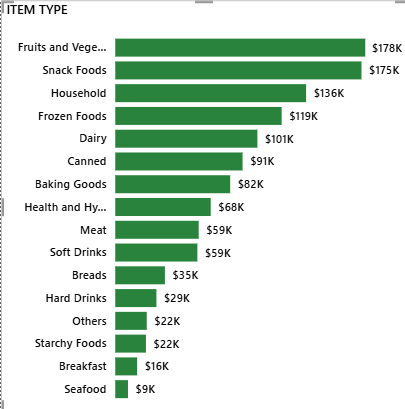
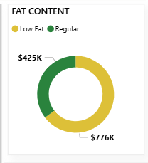
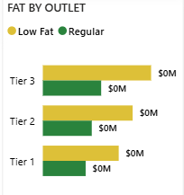
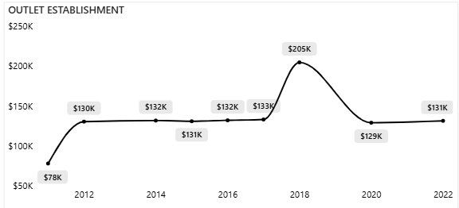

**📊 Blinkit Sales Performance Analysis – Power BI Dashboard**

A Complete End-to-End Data Analytics Case Study

**🚀 Project Overview**

This project presents an interactive Power BI dashboard analyzing Blinkit grocery sales across outlets, product categories, and customer preferences.
It highlights key performance metrics, sales trends, item category contributions, and outlet-level insights to support strategic business decisions.

The project demonstrates strong capabilities in:

**Data Cleaning & Preparation**

Data Modeling

DAX Calculations

Dashboard Design

Business Insight Generation

Storytelling with Data

**🎯 Business Problem**

Blinkit wants to understand what drives its sales performance across:

Outlet types & sizes

City tiers

Product categories

Fat content groups

Customer ratings

The objective is to uncover insights that help improve inventory planning, store strategy, promotions, and customer satisfaction.

**❓ Key Business Questions**

This dashboard answers:

Which item categories contribute most to total sales?

Which outlet locations (Tier 1/2/3) are the highest revenue generators?

Do Low Fat vs Regular Fat items influence sales performance?

What is the historical trend of sales over years?

Which outlets or categories underperform?

What business actions should Blinkit take?

**🧹 Data Cleaning & Preparation**

Performed using Power Query:

Removed duplicates and handled missing values

Standardized categories (Low Fat, Regular)

Fixed inconsistent formatting and data types

Cleaned Outlet Size and Location classifications

Built a clean model for analysis

**📐 Data Modeling**

A simple, analysis-friendly model was used:

Fact Table: Item-Outlet Sales

Dimensions: Item Type, Fat Content, Outlet Size, Outlet Type, Location Type, Year

**🔢 DAX Measures Used**

Total Sales = SUM('BlinkIT Grocery Data'[Item_Outlet_Sales])

Avg Sales = AVERAGE('BlinkIT Grocery Data'[Item_Outlet_Sales])

No of Items Sold = SUM('BlinkIT Grocery Data'[Quantity])

Avg Rating = AVERAGE('BlinkIT Grocery Data'[Rating])

Contribution % = DIVIDE([Total Sales], CALCULATE([Total Sales], ALL('BlinkIT Grocery Data')))

Rating Weighted Sales = SUMX('BlinkIT Grocery Data', 'BlinkIT Grocery Data'[Item_Outlet_Sales] * 'BlinkIT Grocery Data'[Rating])

**📊 Dashboard Preview**

🟨 Complete Dashboard Overview

**🔍 Close-Up Insights**

**⭐ 1. KPI Insights**

**Insights**

Total Sales: $1.20M+

Average Sales per item: $141

Total Items Sold: 8,500+

Average Rating: 3.92

**⭐ 2. Item Type Insights**

**Insights**

Fruits & Vegetables and Snacks dominate revenue

Household, Frozen Foods also perform strongly

Seafood, Breakfast, Hard Drinks underperform

**⭐ 3. Fat Content Insights**

**Insights**

Low Fat items contribute the majority of total revenue

Strong customer preference for Low Fat categories

**⭐ 4. Fat by Outlet Tier**

**Insights**

Tier 3 outlets outperform Tier 1 and Tier 2

Both Low Fat & Regular products sell highest in Tier 3

**⭐ 5. Sales Trend Over Time**

**Insights**

Sales show consistent growth over years

Major peaks in 2017 and 2020

**💡 Key Insights (Summary)**

**🔸 Sales Trends**

Clear growth trend with peaks in 2017 & 2020.

**🔸 Product Insights**

Low Fat items dominate sales.

Top categories: Fruits & Vegetables, Snacks, Household.

Least performing: Seafood, Hard Drinks, Breakfast.

**🔸 Outlet Insights**

Tier 3 outlets deliver the highest sales.

Medium-sized outlets outperform other sizes.

**🔸 Customer Behavior**

Overall customer ratings are strong at 3.92.

**🧭 Recommendations**

✔ 1. Expand in Tier 3 Locations

Strongest revenue potential.

✔ 2. Prioritize Medium-Sized Outlets

Highest sales performance → suitable for expansion.

✔ 3. Promote Low Fat Products

High demand → highlight in app + discount bundles.

✔ 4. Boost Performance of Low-Selling Categories

Use offers, rebranding, repositioning.

✔ 5. Improve Customer Experience

Better service in lower-rated outlets can improve retention.

**🛠 Tools & Technologies**

Power BI Desktop

Power Query

DAX

Excel

Data Modeling

Data Visualization

**📥 How to Use This Project**

1️⃣ Clone or download the repository
git clone https://github.com/yourusername/Blinkit-Sales-Analysis.git

2️⃣ Open the .pbix file in Power BI Desktop

Make sure Power BI is updated.

3️⃣ Explore dashboard with slicers

Filter by outlet size, item type, fat content, etc.

**🧾 Project Files**

Blinkit-Sales-Analysis/
│
├── Blinkit_Dashboard.pbix
├── Blinkit_Project_Report.pdf
├── README.md
└── assets/
      ├── A Blinkit screenshot.png
      ├── A KPI.png
      ├── A fat_content.png
      ├── A item_type.png
      ├── A fat_by_outlet.png
      └── A outlet_establishment.png

**👤 Author**

Likhitha P
Data Analyst | Power BI | SQL | Excel | Python
📩 Email: likithasriramp@gmail.com
🔗 LinkedIn: www.linkedin.com/in/likitha-sriram1220
